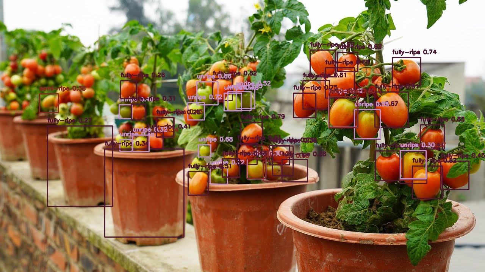

# 🍅 Tomato Ripeness Computer Vision



A computer vision system built using **Python** and **YOLOv8m** to detect and classify tomato ripeness levels from **photos**, **videos**, and **real-time camera input**. This project uses the **TomatOD** dataset to train a model that distinguishes between unripe, semi-ripe, and ripe tomatoes.

## 🚀 Features

- Detects tomatoes in various input sources: images, video files, and live webcam.
- Classifies tomato ripeness into multiple stages.
- Based on **YOLOv8m** for real-time object detection.
- Easily customizable and modular Python-based system.

## 🧠 Tech Stack

- Python
- YOLOv8m (Ultralytics)
- OpenCV
- Jupyter / script-based architecture

## 📊 Dataset

We used the [**TomatOD dataset**](https://www.kaggle.com/datasets/nexuswho/tomatod), a tomato object detection dataset containing over 4,000 annotated images from greenhouse environments.

📦 **TomatOD Dataset (Kaggle Version)**  
🔗 https://www.kaggle.com/datasets/nexuswho/tomatod

📝 **Original Project**:  
GitHub - https://github.com/up2metric/tomatOD  
Published by: [Up2Metric](https://up2metric.com)

The dataset provides annotation for tomato bounding boxes and ripeness stages (unripe, semi-ripe, ripe) with high-quality YOLO-formatted labels.

## 📁 Project Structure
├── images/ # Project assets (e.g., tomato.png)

├── models/ # YOLOv8m trained model weights

├── scripts/

│ ├── detect_image.py # Detect tomatoes from image

│ ├── detect_video.py # Detect tomatoes from video

│ └── detect_cam.py # Real-time detection using webcam

├── tomatod/ # Preprocessed dataset (optional)

├── requirements.txt # Project dependencies

└── README.md # This file


## 📄 Documentation

Setup, training, and usage instructions are documented in full here:

📘 [Project Documentation](https://docs.google.com/document/d/1v_Ew9WaYm2xAltw7PYFq-moW7TPsmuWcNacvYpDnWVg/edit?usp=sharing)

## 🧪 Quick Start

1. **Run the Google Colab Notebook**
Before using this repo, run the following Google Colab notebook to download the pre-trained model, dataset, and evaluation results:
📓 **[Run on Colab](https://colab.research.google.com/drive/1dl26p0aNrG-MtFM85WEqU1nBnnd2u2hW?usp=sharing)**
2. **Extract the Mini Project**
After the Colab finishes:
1. Download the `mini_project.zip` file.
2. Move `mini_project.zip` into the same directory as this GitHub project.
3. **Unzip it manually** using any extractor tool.

You will find a folder named `runs_extracted/` containing:
- `train/` — training visualizations  
- `val/` — validation results  
- `predict/` — image and video predictions  
- `weights/best.pt` — the trained YOLOv8 model
3. **Clone the repo**
``` 
git clone https://github.com/hwasyui/tomatoripeness.git
cd tomatoripeness
``` 
4. **Install dependencies**
```
pip install -r requirements.txt
```
5. **Run detection**
a. Image
``` 
python scripts/detect_image.py --source path/to/image.jpg
``` 
b. Video
``` 
python scripts/detect_video.py --source path/to/video.mp4
``` 
c. Camera
``` 
python scripts/detect_cam.py
``` 

---
| Name | GitHub |
|------|--------|
| **Angelica Suti Whiharto** | [@hwasyui](https://github.com/hwasyui) |
| **Intan Kumala Pasya** | [@tannpsy](https://github.com/tannpsy) |
| **Rason Yudha Pati N** | [@RasonYudha4](https://github.com/RasonYudha4) |
| **Yoel Heardly Sirait** | [@heardlyyoel](https://github.com/heardlyyoel) |

---

📌 Repository
🔗 GitHub: https://github.com/hwasyui/tomatoripeness
